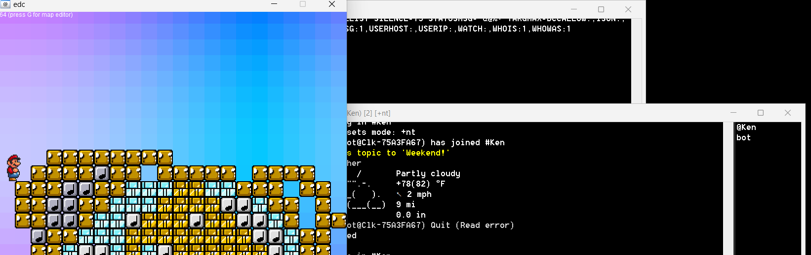

🥁 MIRC Scripts and Bot - 2024

This is a collection of a few irc scripts and a bot that work together.

✅ Install the bot based on the below instructions

✅ Place the script files in the correct directory

✅ Load your irc server - I used unrealircd, self-hosted

✅ Load Mirc

✅ Go to the dir where the bot is and open Terminal. Type: node index.js
In C:\Users\name\AppData\Roaming\mIRC\scripts\irc-translate-bot-main - change Boca Raton to whatever city you'd like

✅The channels default to #Ken - you may change that in the channels.js files

💡 Quick Install via Zip

✅ Download both Zip files and put them where it says. Read on, and learn what the capabilities are, and of course the code (non-zip) version.

Usage:

!weather - ASCII weather

/pe - pixel editor

-es words (Google Translate - change es for any two letter language code and "words" for what you want to translate!)

Go to Commands in Mirc for Mario and Pixel Editor

Where a directory refers to "kenny" instead of "name" - same idea, change it to whatever it is on your end...

This is what it should look like when you use it:


# irc-translate-bot
An irc translation bot using Google Translate, works for every language.
It it located here - https://github.com/forerosantiago/irc-translate-bot

## Installation

First, clone this repository and cd into it:
```
git clone https://github.com/forerosantiago/irc-translate-bot && cd irc-translate-bot/
```

Install the dependencies:
```
npm install
```

Edit the `config.json` file:
```
{
    "nick": "bot",
    "server": "127.0.0.1"
}
```

Execute it:
```
node index.js
```

## Usage
Once the bot is running and connected to an irc server you can use it like this:

```
-es Text to be translated
```

The command is the iso code for the desired language, a list of all the iso language codes can be found [here](https://en.wikipedia.org/wiki/List_of_ISO_639-1_codes).


### Joining and leaving channels
You can make the bot join any channel you want using the irc `/invite` commmand, the bot will remember it and join again if it gets disconnected.

If you don't want the bot to be in your channel anymore you can simply use the `/kick` command with it, it will forget your channel and won't come back unless reinvited.





I use this on a self-hosted irc server. You can:

✅ Play Mario 

✅ Translate

✅ Get the weather

✅ Use a pixel editor

🎸 Bonus - weather-no-menu.html displays the ASCII weather on an html page. No dependencies. I think it looks cool:


